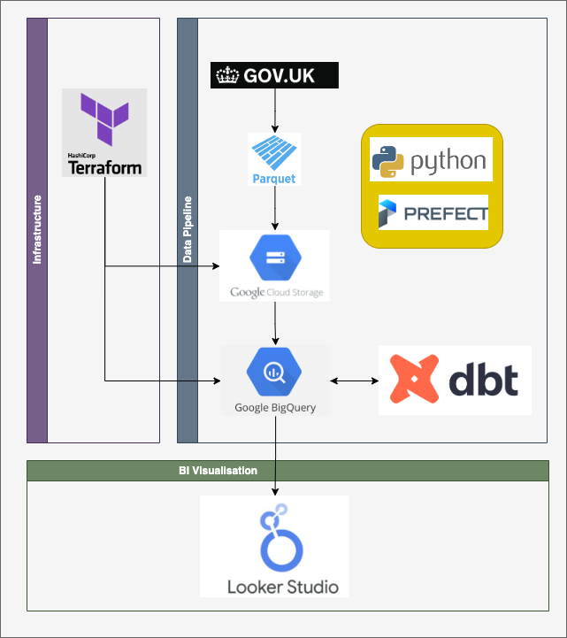
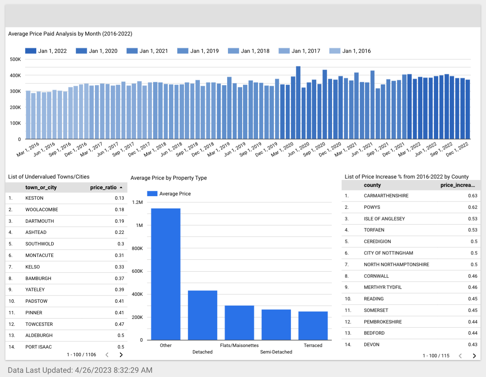
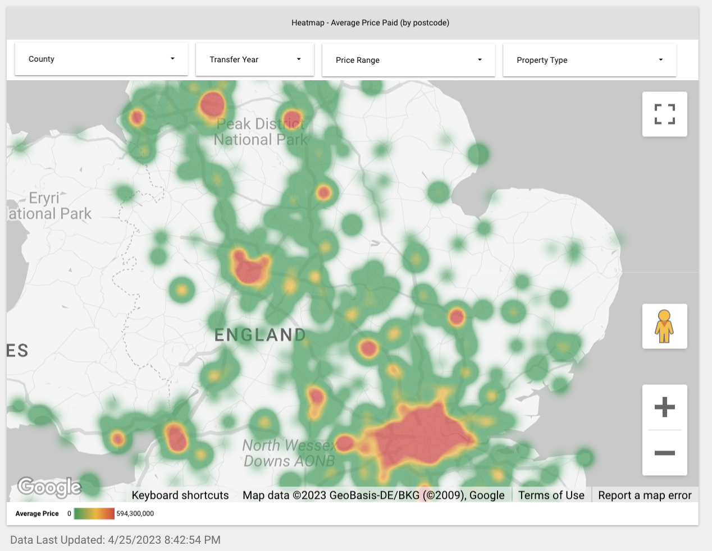
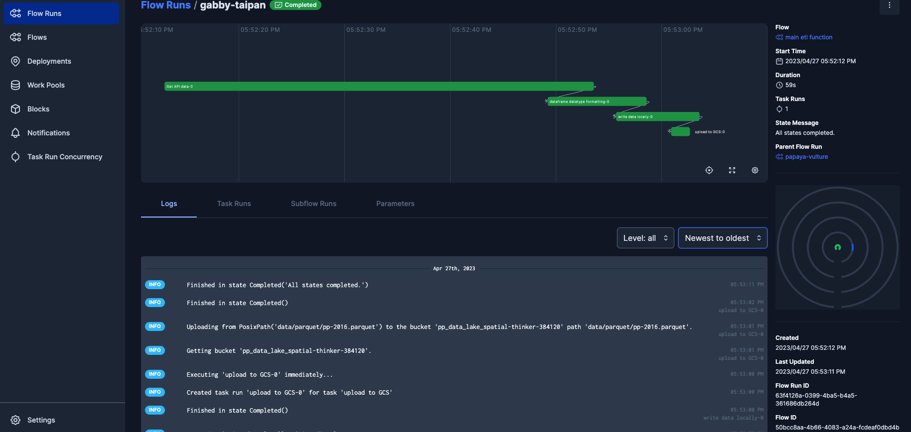

# UK Prices Paid Dataset (2016-2022)

# Table of contents
- [Project Overview](#project-overview)
- [Project Reproduction](#project-reproduction)
- [Pipeline Overview](#overview-of-final-pipeline)
- [Future Development](#future-development)

# Project Overview
This repo contains my project for the [Data Engineering Zoomcamp](https://github.com/DataTalksClub/data-engineering-zoomcamp). The key aim of this project was to explore fundamental data engineering concepts by working on a real-world project using publically available data. This project involved using various tools such as Prefect, Google Cloud Storage, BigQuery, Terraform, DBT, and Looker Studio to develop a dashboard that could:
- Show a heatmap of average house prices across the UK
- Investigate potential questions such as undervalued areas, areas that experienced the greatest growth, the difference between average house price split by property type.
- Display the overall average price over time in a time series chart.

## Data Set
The Price Paid dataset was used for this project, which can be downloaded from the [UK government statistical data sets website](https://www.gov.uk/government/statistical-data-sets/price-paid-data-downloads#yearly-file). The data was used for the period between 2016 and 2022 to understand the house prices trends in the UK.

## Data Dictionary
| Data item	| Explanation (where appropriate) |
|-----------|---------------------------------|
|Transaction unique identifier |	A reference number which is generated automatically recording each published sale. The number is unique and will change each time a sale is recorded.
| Price |	Sale price stated on the transfer deed.
| Date of Transfer	| Date when the sale was completed, as stated on the transfer deed.
| Postcode	| This is the postcode used at the time of the original transaction. Note that postcodes can be reallocated and these changes are not reflected in the Price Paid Dataset.
| Property Type |	D = Detached, S = Semi-Detached, T = Terraced, F = Flats/Maisonettes, O = Other
| Old/New |	Indicates the age of the property and applies to all price paid transactions, residential and non-residential. Y = a newly built property, N = an established residential building
| Duration	| Relates to the tenure: F = Freehold, L= Leasehold etc.
| PAON	| Primary Addressable Object Name. Typically the house number or name.
| SAON	| Secondary Addressable Object Name. Where a property has been divided into separate units (for example, flats), the PAON (above) will identify the building and a SAON will be specified that identifies the separate unit/flat.
|Street	 |
|Locality	| 
|Town/City	| 
|District	| 
|County	 |
|PPD Category Type |	Indicates the type of Price Paid transaction. A = Standard Price Paid entry, includes single residential property sold for value. B = Additional Price Paid entry including transfers under a power of sale/repossessions, buy-to-lets (where they can be identified by a Mortgage), transfers to non-private individuals and sales where the property type is classed as ‘Other’.
| Record Status - monthly file only	| Indicates additions, changes and deletions to the records.(see guide below). A = Addition C = Change D = Delete

## Tools Used
The following tools were used for this project:
- Google Storage buckets used as the Data Lake
- Google Bigquery datasets used as the Data Warehouse
- Google Looker Studio utilized for Data Visualization
- Terraform used as Infrastructure as Code for deploying Google Storage buckets and Google Bigquery
- Python scripts used as the data pipeline for retrieving data from gov.uk website, cleaning the data and storing the files locally in parquet format
- Prefect used as the orchestration tool to download the data locally, upload to GCS, stage the data in BiqQuery, run the dbt models. A local instance of the Prefect Orion server is used for easy peer reviews.
- dbt used for staging and production data environments. A local instance of dbt core is used for easy peer reviews.
- Parquet columnar data files utilized

## Dashboard Features
[Dashboard Link](https://lookerstudio.google.com/s/vHRsiod1xcY)

The project aimed to create a dashboard that could:
- Show a heatmap of average house prices across the UK
- Identify undervalued areas
- Identify areas that experienced the greatest growth
- Display the difference between average house price across different property types (flats vs detached houses for example)
- Display the overall average monthly price, across all regions for 2016-2022

# Project Reproduction

This project has been tested on Mac OS with a conda virtual environment.

1. Clone the repo to the desired directory `git clone https:// ADD THIS HERE ONCE PUSHED`

2. Set up GCP
    - Register for a GCP account and create a project, noting down the project ID.
    - Set up a GCP IAM service account by navigating to IAM, Service accounts, and creating a new service account. We'll use this to programatically access google cloud services from the command line.
    - Grant the service account the appropriate roles, including Viewer, Storage Admin, Storage Object Admin, and BigQuery Admin.
    - Create and store a key to your desired directory by clicking on Actions, managing keys, add key (JSON option). Save the key in a desired (private) directory
    - Check if gcloud CLI is installed by typing `gcloud version` in your terminal. If it isn't installed follow the installation instructions [here](https://cloud.google.com/sdk/docs/install)
    - To initialize the gcloud CLI, type `export GOOGLE_APPLICATION_CREDENTIALS="path_to_service_account_creds.json"` and adding the full path to the JSON key that you downloaded previously.
    - On your terminal, run `gcloud auth activate-service-account --key-file $GOOGLE_APPLICATION_CREDENTIALS`
    - You should see a message saying that your service account is activated.

3. Terraform Setup
    - [Download terraform if you don't already have it](https://developer.hashicorp.com/terraform/downloads)
    - Enable terraform to be run anywhere, by adding the absolute path to the terraform binary to your system's environmental vairable. Run `echo $PATH` then move the binary into one of the listed locations with a command like `mv ~/Downloads/terraform /usr/local/bin/`
    - Make sure these the [IAM API](https://console.cloud.google.com/apis/library/iam.googleapis.com) and [IAMcredentials API](https://console.cloud.google.com/apis/library/iamcredentials.googleapis.com) are enabled
    - Navigate to `/terraform/variables.tf` And check that the region matches your region of the GCP account created earlier. It's important to keep the BiqQuery and GCS Bucket as they are, as Prefect and DBT will reference these later.
    - Run `cd terraform` then `gcloud auth application-default login` then `Y`. Make sure you log in with the right google account. You should see an authentication message saying that terraform is authenticated with google cloud.
    - Run `terraform init`
    - Run `terraform plan` (input gcp project id. Check the resources that will be created)
    - Run `terraform apply` and go check GCP to see if your GCS bucket is created aswell as BigQuery with your specified dataset/schema

4. Pipeline setup
    - create a conda environment (or similar) with a command like `conda create --name project_name python=3.9`
    - activate the environment with `conda activate project_name`
    - install the project dependencies with `pip install -r setup/requirements.txt`
    - navigate to `setup/prefect_block_setup.py` and input the path to you GCP credentials, as well as your GCS bucket name
    - in a new terminal window navigate back to the root folder and run `prefect orion start`
    - in the other terminal window run `prefect config set PREFECT_API_URL=http://127.0.0.1:4200/api` and click on the localhost url
    - in the same terminal window as the previous step, run `python3 setup/prefect_block_setup.py`
    - [check the blocks](http://127.0.0.1:4200/blocks) in prefect orion. There should be 3 blocks `BigQuery Warehouse`, `GCP Credentials` and `GCS Bucket`

5. Data Checks (optional - this step is not neccesary for project reproduction)
    - Before running the pipeline, you can double check that the data is accessible at the link, and run some basic data quality checks
    - I did this to gain some initial insight into the dataset before writing the main pipeline. For example, data size, how many nulls in each column, max/min of price and date to see if I need to do any data cleansing. Luckily the data all seemed clean so I didn't need to do any cleansing in the pipeline.
    - To do this first run `python3 scripts/1.exploration/_get_data.py` - this should take around 10 minutes and should download the .csv files into `data/csv/`
    - Finally, run `python3 scripts/1.exploration/dq_checks.py` to see the various summary statistics and data quality checks about each file

# Overview of Final Pipeline
- The code loops through each year (2016-2022)
    - stores the data in dataframes and doing some basic data cleansing
    - writes a file out locally in parquet format (1 for each year)
    - upload the file to GCS using the prefect block we created earlier
    - uses the BiqQuery block we created to union all the tables and stage one final external dataset in the data warehouse
    - creates a staging dataset which is partitioned by year, and clustered by county for performance
    - runs the dbt models and transformations which do the following:
        - creates a staging copy of the data in a seperate `staging` schema
        - creates a `prod` (core) schema containing the following datasets:
            - prices_paid - this is a copy of the staging dataset, with some additional transformations to help with the data visualisation
            - report_avg_pp - this is an aggregated report table which looks at the average price paid per month across the whole country
            - report_pp_growth - this is an aggregated report table which looks at the counties that have experienced high growth over the 2016-2022 period
            - report_pp_undervalued - this is an aggreagated report table which looks at areas which may be undervalued in their region. 
    
- To run this, first make sure you have added your gcp creds path to the `scripts/2.extract_load/main_pipeline.py` file
- Then run `python3 scripts/2.extract_load/main_pipeline.py` - it should take about 15 minutes.
- on completion you can test that it has worked by running `python3 scripts/2.extract_load/data_checks.sql` in BiqQuery, as well as by checking the dashboard link: https://lookerstudio.google.com/s/hOWt5li4vOs
- You can watch the progress at the [prefect orion localhost url](http://127.0.0.1:4200/flows) and you should see something like the below screenshot:

# Future development
- Changing the main pipeline to ingest the monthly file, instead of the yearly file, and running a cron job to pickup the new files as they appear each month
- Adding to the above, utilising an incremental load in DBT and a SCD for dimensions, rather than just replacing all the tables on each pipeline run
- Utilising docker to containerize everything
- Automating the whole process, e.g, creating make files or setup files to do most of the steps above^
- Creating a proper star schema with facts and dimensions - I was particularly interested in mapping the postcodes to some shape files so proper geo-spatial analysis could be done (e.g, looking at affluence, deprivation by postcode etc). All of this would require a proper dim_address table to be made and mapped to files available on statistics.gov.uk but I ran out of time
- Enhancing the tests in DBT and utilising macros
- Doing some proper data analysis and visualisation, I was more focussed on the pipeline side of things and learning prefect, DBT, google cloud platform and python which are all new to me - but I feel like I could develop the dashboard and analysis side a bit more if I had more time